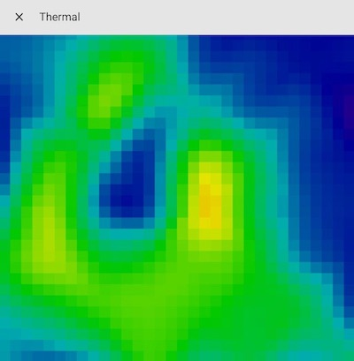
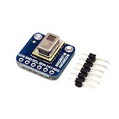

[](https://github.com/custom-components/hacs)

*Please :star: this repo if you find it useful*

<p align="left"><br>
<a href="https://paypal.me/eyalco1967?locale.x=he_IL" target="_blank"></a>
</p>

# Thermal

The `thermal` implementation allows you to integrate your thermal sensor to Home Assistant.



(Me saying hello)

There is currently support for the following device types within Home Assistant:

- [Camera](#camera)
- [Sensor](#sensor)

## Table of Contents

* [Requirements](#requirements)
* [Installation](#installation)
  * [Manual Installation](#manual-installation)
  * [Installation via HACS](#installation-via-hacs)
* [Configuration](#configuration)
  * [Configuration Parameters](#configuration-parameters)
* [Advanced Configuration](#advanced-configuration)
* [Thermal Sensors](#thermal-sensors)

## Requirements

For the integration to work with a thermal sensor, the thermal sensor device should respond to the following HTTP API requests:

| API | Type | Response | Example
---|---|---|:---
/raw | GET | JSON | `{"sensor":AMG8833","rows":8,"cols":8,"data":"23.00,22.75,22.25,23.25,23.25,23.50,23.50,23.50,22.75,23.00,23.00,23.00,23.00,22.75,22.75,22.75,23.25,22.75,23.00,22.75,22.50,23.25,23.50,23.25,22.50,22.75,22.75,22.75,23.00,23.00,22.50,22.50,22.00,22.50,22.75,22.25,22.75,22.75,23.25,22.50,21.75,22.50,22.50,22.75,22.50,22.50,22.50,23.00,22.50,22.25,21.75,21.75,22.50,22.50,22.75,23.00,21.75,22.50,22.00,21.50,22.25,22.00,22.50,23.00"}`

See the GridEye example in the examples folder.

## Installation

### MANUAL INSTALLATION

1. Download the `thermal.zip` file from the
   [latest release](https://github.com/eyalcha/Thermal/releases/latest).
2. Unpack the release and copy the `custom_components/thermal` directory
   into the `custom_components` directory of your Home Assistant
   installation.
3. Configure the `thermal` camera / sensor.
4. Restart Home Assistant.

### INSTALLATION VIA HACS

1. Ensure that [HACS](https://custom-components.github.io/hacs/) is installed.
2. Search for and install the "thermal" integration.
3. Configure the `thermal` camera / sensor.
4. Restart Home Assistant.

## Configuration

### Camera

```yaml
# Example configuration.yaml entry

camera:
  platform: thermal
  host: http://192.168.0.10
```

Main Options

|Parameter |Required|Description
|:---|---|---
| `platform` | Yes | Platfrom name
| `name` | No | Friendly name **Default**: Thermal
| `host` | Yes | IP address of your Thermal sensor server
| `width` | No | Image width in pixels **Default**: 640
| `height` | No | Image height in pixels **Default**: 640
| `rotate` | No | Rotate image **Default**: 0
| `mirror` | No | Mirror image true / false **Default**: false
| `min_temp` | No | Min temperature **Default**: 26
| `max_temp` | No | Max temperature **Default**: 32
| `method` | No | Interpolation method (`bicubic`, `linear`) **Default** bicubic
| `cold_color` | No | Cold color **Default**: indigo
| `hot_color` | No | Hot color **Default**: red

### Sensor

```yaml
# Example configuration.yaml entry

sensor:
  - platform: thermal
    host: http://192.168.0.10
```

Main Options

|Parameter |Required|Description
|:---|---|---
| `platform` | No | Platfrom name
| `name` | No | Friendly name **Default**: Thermal
| `host` | Yes | IP address of your Thermal sensor server
| `scan_interval`| No | Get raw data interval **Default**: 60 seconds
| `sensor` | No | Sensor related configurations
| `roi` | No | Sensor region of interest
| `state` | No | Sensor state type (`average`, `max`, `min`) **Default**: max

Sensor

|Parameter |Required|Description
|:---|---|---
| `rows` | Yes | Number of rows in sensor data **Default**: 8
| `cols` | Yes | Number of columns in sensor data **Default**: 8

ROI

|Parameter |Required|Description
|:---|---|---
| `left` | Yes | Left pixel index [0:cols-1] **Default**: 0
| `top` | Yes | Top pixel index [0:rows-1] **Default**: 0
| `right` | Yes | Right pixel index [0:cols-1] **Default**: 7
| `bottom` | Yes | Bottom pixel index [0:rows-1] **Default**: 7

### State and Attributes

#### State

The sensor state can be one of the following values (all values relates to configured roi):

- Average temperature
- Max temperature
- Min temperature

#### Attributes

The sensor attributes are (all values relates to configured roi):

- Average temperature
- Max temperature
- Min temperature

## Advanced Configuration

You can also use this more advanced configuration example:

### Sensor

```yaml
# Example configuration.yaml entry

sensor
  - platform: thermal
    name: My Thrermal
    host: http://192.168.0.194
    scan_interval: 2
    sensor:
      rows: 8
      cols: 8
    roi:
      left: 3
      top: 3
      right: 5
      bottom: 5
    state: max
```

### Camera

```yaml
# Example configuration.yaml entry

camera:
  platform: thermal
  name: My Camera
  host: http://192.168.0.194
  min_temp: 20
  max_temp: 30
  mirror: True
```

# Services

TBI

# Thermal Sensors

The following thermal sensors are known to work with the integration

Sensor | Image
---|---
[AMG8833](https://eu.industrial.panasonic.com/products/sensors-optical-devices/sensors-automotive-and-industrial-applications/infrared-array/series/grid-eye-high-performance-type-amg8833/ADI8005/model/AMG8833) | 

---

I put a lot of work into making this repo and component available and updated to inspire and help others! I will be glad to receive thanks from you — it will give me new strength and add enthusiasm:
<p align="center"><br>
<a href="https://paypal.me/eyalco1967?locale.x=he_IL" target="_blank"></a>
</p>